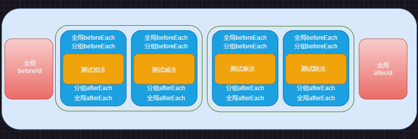

- [Jest 快速入门](#jest-快速入门)
  - [测试用例的分组](#测试用例的分组)
  - [匹配器](#匹配器)
    - [常用匹配器](#常用匹配器)
    - [布尔相关匹配器](#布尔相关匹配器)
    - [字符串相关的匹配器](#字符串相关的匹配器)
    - [数组相关匹配器](#数组相关匹配器)
    - [异常匹配器](#异常匹配器)
    - [非对称匹配器](#非对称匹配器)
    - [部分源码](#部分源码)
  - [生命周期方法](#生命周期方法)
    - [重复性的生命周期方法](#重复性的生命周期方法)
    - [一次性的生命周期方法](#一次性的生命周期方法)
    - [在分组中添加生命周期函数](#在分组中添加生命周期函数)

# Jest 快速入门

- 初始化项目

  `npm init -y`

```js
/**
 * 工具库
 */

exports.sum = function (a, b) {
  return a + b;
};

exports.sub = function (a, b) {
  return a - b;
};

exports.mul = function (a, b) {
  return a * b;
};

exports.div = function (a, b) {
  return a / b;
};
```

- 安装 Jest

  `npm install --save-dev jest`

  > 在项目下面创建测试文件 `tools.test.js`,安装了 jest 之后，会提供一些全局方法或对象 例如：`test、expect、jest`，这些方法或对象不需要导入，直接在测试文件中使用

```js
const { sum, sub, mul, div } = require("./tools");

/**
 * 一个test 方法
 */
test("测试加法", () => {
  expect(sum(1, 2)).toBe(3);
});

test("测试减法", () => {
  expect(sub(5, 3)).toBe(2);
});

/**
 * it函数就是test函数的别名
 */
it("测试乘法", () => {
  expect(mul(2, 6)).toBe(12);
});

it("测试除法", () => {
  expect(div(100, 2)).toBe(50);
});
```

> 修改 `package.json` 文件

```js
...
"scripts": {
  "test": "jest"
},
...
```

```js
    npm run test

    > JestDemo@1.0.0 test E:\workspace\fremawork-path\前端自动化测试\JestDemo
    > jest

    PASS  ./tools.test.js
    √ 测试加法 (3 ms)
    √ 测试减法 (1 ms)
    √ 测试乘法
    √ 测试除法 (1 ms)

    Test Suites: 1 passed, 1 total
    Tests:       4 passed, 4 total
    Snapshots:   0 total
    Time:        0.548 s, estimated 1 s
    Ran all test suites.
```

> 最好的方式使一个工具函数对应一个测试套件，每个测试套件里面根据函数的参数来书写测试用例，一个参数对应一个测速用例。

## 测试用例的分组

> 在一个测试套件中，可以针对不同的测试用例来进行分组。

> 分组使用 `describe` 函数，这个函数也是一个全局函数，不需要导入，直接使用。

```js
descrbe('分组名称的描述'，回调函数)
示例如下：
describe("这是一组测试，测试加减法", () => {
  // 回调函数中就放一个一个的测试用例
  test("测试加法", () => {
    expect(sum(1, 2)).toBe(3);
  });

  test("测试减法", () => {
    expect(sub(5, 3)).toBe(2);
  });
});

describe("这是一组测试，测试乘除法", () => {
  // 回调函数中就放一个一个的测试用例
  it("测试乘法", () => {
    expect(mul(2, 6)).toBe(12);
  });

  it("测试除法", () => {
    expect(div(100, 2)).toBe(50);
  });
});
```

## 匹配器

> 在 Jest 中提供了丰富的匹配器（Matchers）

> 目前在 Jest 里面支持的修饰符有 3 个：

- `.not`
- `.resolves`
- `.rejects`

下面是.not 修饰符的示例：

```js
test("测试.not修饰符", () => {
  expect(sum(3 + 3)).not.toBe(5);
});
```

`resolves`和`rejects`是和`Promise`相关的,在测试异步函数的时候会使用到。

Jest 里面内置了非常多的匹配器：

- 常用匹配器
- 布尔值相关匹配器
- 数值相关匹配器
- 字符串相关匹配器
- 数组相关匹配器
- 异常相关匹配器
- 非对称匹配器

### 常用匹配器

常用的匹配器这里列举两个,`toBe`、`toEqual`

> `toBe`与`toEqual`匹配器的区别就是：

```
 - toBe 只能对对象进行一个浅比较 例如：它只能比较两个对象的引用地址时候一致 不能对比对象属性
 - toEqual可以针对对象进行一个深度比较 会递归比较对象的所有属性
```

toBe 深度比较示例：

```js
test("深度比较对象", () => {
  const stu = { name: "张三", score: { html: 100, css: 90 } };

  expect(stu).toBe({ name: "张三", score: { html: 100, css: 90 } });
});
```

执行结果：

```js
× 深度比较对象 (7 ms)

  ● 深度比较对象

    expect(received).toBe(expected) // Object.is equality

    If it should pass with deep equality, replace "toBe" with "toStrictEqual"

    Expected: {"name": "张三", "score": {"css": 90, "html": 100}}
    Received: serializes to the same string

      58 |   const stu = { name: "张三", score: { html: 100, css: 90 } };
      59 |
    > 60 |   expect(stu).toBe({ name: "张三", score: { html: 100, css: 90 } });
         |               ^
      61 | });
      62 |

      at Object.toBe (tools.test.js:60:15)

Test Suites: 1 failed, 1 total
Tests:       1 failed, 1 total
Snapshots:   0 total
Time:        0.594 s, estimated 3 s
```

toEqual 深度比较示例：

```js
test("深度比较对象", () => {
  const stu = { name: "张三", score: { html: 100, css: 90 } };

  // 使用 toEqual 来进行深度比较
  // toEqual 会递归比较对象的所有属性
  expect(stu).toEqual({ name: "张三", score: { html: 100, css: 90 } });
});
```

执行结果：

```js
√ 深度比较对象 (3 ms)

Test Suites: 1 passed, 1 total
Tests:       1 passed, 1 total
Snapshots:   0 total
Time:        0.545 s, estimated 1 s
Ran all test suites.
```

### 布尔相关匹配器

> 一般来讲 运行结果的到的是一个布尔值，使用布尔值相关匹配器的时候一般是无需传参的。

布尔值相关匹配器：

- toBeFalsy()
- toBeTruthy()

```js
test("布尔值相关匹配器", () => {
  const n = null;
  expect(n).toBeFalsy();
  expect(n).not.toBeTruthy();
});
```

无参数相关匹配器：

- toBeNull()
- toBeDefined()
- toBeUndefined()

```js
test("无参数匹配器", () => {
  const n = null;
  expect(n).toBeNull();
  expect(n).toBeDefined();
  expect(n).not.toBeUndefined();
});
```

数值相关匹配器：
常见的就是两个数值之间的比较，有 大于、大于等于、小于、小于等于、等于之类的：

- toBeGreaterThan()
- toBeGreaterThanOrEqual()
- toBeLess()
- toBeLessOrEqual()
  > 因`浮点数有一个舍入误差` 只要编程语言中使用了`IEE754`这个标准 就无法精确做浮点数的计算 所以这里无法使用`toBe`做浮点数匹配
- toBeClose(期望接近的值，小数位数) 解决了上面浮点数无法匹配的问题

### 字符串相关的匹配器

`toMatch`可以检查 字符串是否和一个正则表达式 能够匹配上。

```js
test("字符串相关匹配器", () => {
  expect("this is a test").toMatch(/test/);
  expect("this is a test").not.toMatch(/abc/);
});
```

### 数组相关匹配器

一个常见的需求就是 需要判断一个数组中是否包含某一项，这个时候可以使用`toContain`。

```js
test("数组相关匹配器", () => {
  const shoppingList = ["apple", "milk", "water", "paper"];
  expect(shoppingList).toContain("water");
  // toContain 进行的是全等于比较，也就是比较严格
  expect([1, 2, 3]).not.toContain("1");
  expect({ name: "张三" }).not.toContain({ name: "张三" });
  //toContain 还可以检测 一个字符串是否是另一个字符串的子串
  expect("this is a test").toContain("test");
  // 也可以用到集合（set）里面
  expect(new Set(shoppingList)).toContain("water");
});
```

### 异常匹配器

需求一般是 我们测试某个函数调用之后 它是否会抛出这个异常

- toThrow

```js
const compileCode = () => {
  throw new Error("You're throwing an error.");
};

test("异常相关匹配器", () => {
  expect(() => compileCode()).toThrow();
  // toThrow 里面可以传递不同的参数
  // 字符串 判断异常中是否包含该子串
  expect(() => compileCode()).toThrow("throwing");
  // 异常对象
  expect(() => compileCode()).toThrow(Error);
  // 正则
  expect(() => compileCode()).toThrow(/error/);
});
```

### 非对称匹配器

上面举例的匹配器都属于对称匹配器 例如：

```js
test("深度比较对象", () => {
  const stu = { name: "张三", score: { html: 100, css: 90 } };
  expect(stu).toEqual({ name: "张三", score: { html: 100, css: 90 } });
});
```

上面的这个 toBe 就是一个对称匹配器，在 Jest 中还存在一些非对称匹配器：

- toEqual(expect.not.arrayContaining(arr))

```js
const arr = ["张三"];
test("上面的数组不包含某一项", () => {
  // toEqual(参数中属于一段描述：期望数组中不包含arr中的值)
  expect(["李四", "王五"]).toEqual(expect.not.arrayContaining(arr));
});
```

```js
const obj = { name: "张三" };
test("对象不包含上面的键值对", () => {
  expect({ name: "李四" }).toEqual(expect.not.objectContaining(obj));
});
```

### 部分源码

在源码中，所有的匹配器都放在了一个名为 matchers 的对象里面

```js
const matchers = {
  toBe(){/**  */}
  toBeCloseTo(){/**  */}
  //...
}
```

在 expect 方法里面，实际上调用该方法后会返回一个匹配器对象 expectation,示例：

```js
const expectation = {
  not: {},
  rejects: { not: {} },
  resolves: { not: {} },
};
```

之后会为 expectation 这个对象添加上所有的匹配器方法，示例：

```js
const expect = () => {
  // 获取到所有的matchers
  // 该对象是要向外部返回的
  const expectation = {
    not: {},
    rejects: { not: {} },
    resolves: { not: {} },
  };

  // 将 matchers 对象上的所有的匹配器添加到 expectation 对象上面
  Object.keys(matchers).forEach((name) => {
    expectation[name] = mathchers[name];
    //...
  });

  return expectation;
};
```

## 生命周期方法

在 jest 中，生命周期方法大致分为两种：

- 重复性的生命周期方法
  - beforeEach
  - afterEach
- 一次性的生命周期方法
  - beforeAll
  - afterAll
    上面所罗列的生命周期方法，也是全局方法，不需要引入，直接使用。

### 重复性的生命周期方法

所谓重复性的生命周期方法，就是指这些方法会被添加到每一个测试用例的前后.

```js
beforeEach(() => {
  console.log("全局的BeforeEach");
});

afterEach(() => {
  console.log("全局的AfterEach");
});

test("测试加法", () => {
  expect(sum(1, 2)).toBe(3);
  console.log("\x1b[31m%s\x1b[0m", "测试加法");
});

test("测试减法", () => {
  expect(sub(5, 3)).toBe(2);
  console.log("\x1b[31m%s\x1b[0m", "测试减法");
});

/**
 * it函数就是test函数的别名
 */
it("测试乘法", () => {
  expect(mul(2, 6)).toBe(12);
  console.log("\x1b[31m%s\x1b[0m", "测试乘法");
});

it("测试除法", () => {
  expect(div(100, 2)).toBe(50);
  console.log("\x1b[31m%s\x1b[0m", "测试除法");
});
```

上面的代码 为每一个测试用例添加了生命周期方法，beforeEach 和 afterEach 会在每一个测试用例的前后执行。


### 一次性的生命周期方法

对应的方法：

- beforeAll
- afterAll

```js
beforeAll(() => {
  console.log("全局的BeforeAll");
});

afterAll(() => {
  console.log("全局的AafterAll");
});

beforeEach(() => {
  console.log("全局的BeforeEach");
});

afterEach(() => {
  console.log("全局的AfterEach");
});

test("测试加法", () => {
  expect(sum(1, 2)).toBe(3);
  console.log("\x1b[31m%s\x1b[0m", "测试加法");
});

test("测试减法", () => {
  expect(sub(5, 3)).toBe(2);
  console.log("\x1b[31m%s\x1b[0m", "测试减法");
});

/**
 * it函数就是test函数的别名
 */
it("测试乘法", () => {
  expect(mul(2, 6)).toBe(12);
  console.log("\x1b[31m%s\x1b[0m", "测试乘法");
});

it("测试除法", () => {
  expect(div(100, 2)).toBe(50);
  console.log("\x1b[31m%s\x1b[0m", "测试除法");
});
```


### 在分组中添加生命周期函数

如果测试用例比较多，我们可以使用 describe 来进行分组，在一个分组里面也可以书写生命周期方法，但是在分组中的生命周期方法会变为一个局部的生命周期方法，仅对该组测试用例有效，而且这里还涉及到了一个顺序的问题。

```js
beforeAll(() => {
  console.log("\x1b[31m%s\x1b[0m", "全局的BeforeAll");
});

afterAll(() => {
  console.log("\x1b[31m%s\x1b[0m", "全局的AafterAll");
});

beforeEach(() => {
  console.log("\x1b[31m%s\x1b[0m", "全局的BeforeEach");
});

afterEach(() => {
  console.log("\x1b[31m%s\x1b[0m", "全局的AfterEach");
});

describe("第一组", () => {
  beforeEach(() => {
    console.log("\x1b[31m%s\x1b[0m", "分组的BeforeEach");
  });

  afterEach(() => {
    console.log("\x1b[31m%s\x1b[0m", "分组的AfterEach");
  });

  test("测试加法", () => {
    expect(sum(1, 2)).toBe(3);
    console.log("\x1b[31m%s\x1b[0m", "测试加法");
  });

  test("测试减法", () => {
    expect(sub(5, 3)).toBe(2);
    console.log("\x1b[31m%s\x1b[0m", "测试减法");
  });
});

describe("第二组", () => {
  beforeEach(() => {
    console.log("\x1b[31m%s\x1b[0m", "分组的BeforeEach");
  });

  afterEach(() => {
    console.log("\x1b[31m%s\x1b[0m", "分组的AfterEach");
  });

  it("测试乘法", () => {
    expect(mul(2, 6)).toBe(12);
    console.log("\x1b[31m%s\x1b[0m", "测试乘法");
  });

  it("测试除法", () => {
    expect(div(100, 2)).toBe(50);
    console.log("\x1b[31m%s\x1b[0m", "测试除法");
  });
});

```
如果既有全局的beforeEach又有分组内部的beforeEach,那么是先执行全局的beforeEach,再执行分组的beforeEach,如果是全局afterEach以及分组的afterEach,那么执行的顺序正好和beforeEach相反。
